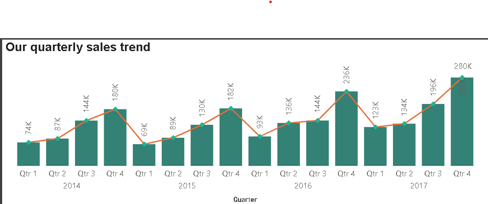

# 📈 Sales Performance Dashboard (Power BI)

<!-- Cover image of the full dashboard -->

---

## 📌 Project Overview
This project analyzes sales data to track business performance, identify trends, and provide actionable insights for decision-making.  
The dashboard highlights key metrics like total sales, top products, regional performance, and seasonal trends.

---

## 🎯 Objectives
- Track total sales over time
- Identify top-performing products and regions
- Support data-driven business decisions

---

## 📂 Dataset
All dataset files used for this dashboard are in the `Data` folder:
- `sample_superstore.csv`
- `sample_superstore_cleaned.xlsx`

---

## 📊 Dashboard & Key Visuals

**Full dashboard file:** `Dashboard/Sales_perforrmace.pbix"`

**Screenshots of key visuals:**

---

## 🔍 Key Insights
- The West region generated the highest revenue  
- the staple envelope sold the most over the years. However the Canon imageCLASS 2200 Advanced copier brought in the most profit.
- Sales drop at the first quarter of every year and peak by the fourth quater  

---

## 💡 Recommendations
- Focus marketing campaigns in the West Region for higher ROI  
- Restock top-selling products promptly and focus on increasing sales for the most profitable products.
- Analyze low-performing products to improve sales strategy  
- Monitor seasonal trends to plan inventory and promotions

---

## 🛠 Tools Used
- Power BI Desktop  
- Excel (for raw and cleaned data)  
- CSV / Excel datasets
